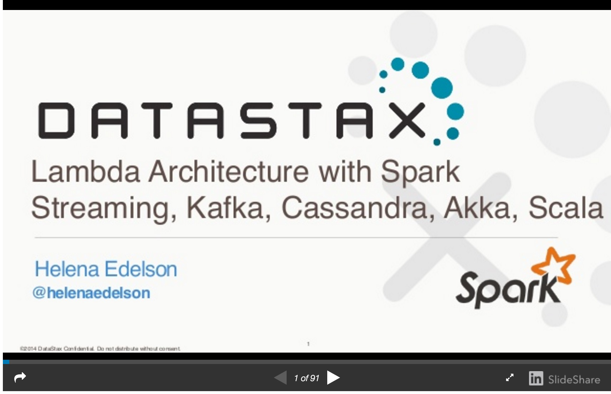

hexo-pdf
====


Hexo tag for embeded pdf

## Install

```
$ npm install --save hexo-pdf
```


## Usage

### Normal PDF

```

```

or
```

```

### Google drive
```

```

### Slideshare
```

```
## Preview

### Normal PDF


### Google drive


### Slideshare

